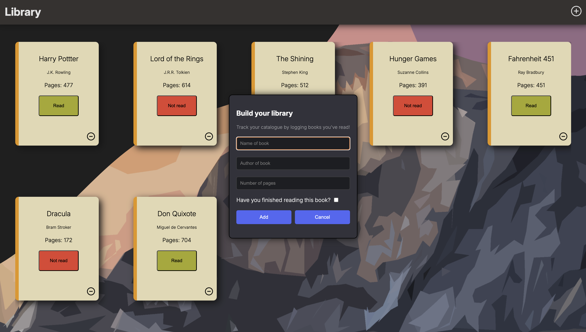

# Book Catalogue

An application to help you track your reading list! Log which books you've already read and ones which you're looking forward to in the future.

## Purpose

The purpose of this page is to test my understanding of fundamental HTML/CSS/Javascript concepts
## Features

**Toastify** - Javascript library used for error handling and form validation

## Roadmap

- Light/dark mode toggle
- Live previews
- Fullscreen mode
- Cross platform

## Acknowledgements

 - [README creation template](https://readme.so/)

